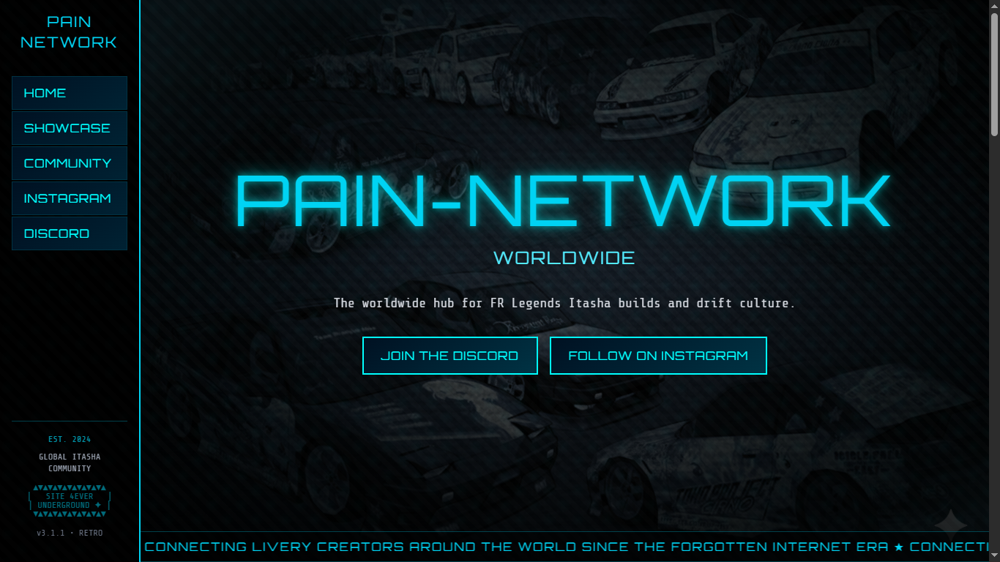

# Pain Network Worldwide



Retro-inspired landing page (2000s Japanese tuner / cyberpunk aesthetic) built with modern tooling: React, Vite and Radix UI.

This README explains how to run the project locally, where to edit content, and what the important files are.

## Highlights

- Purpose: A nostalgic, responsive landing page with bold styling and component-driven structure.
- Tech: React 18 + TypeScript, Vite, Radix UI, and modern CSS.
- UX: Mobile-first responsive design with a retro visual language.

## Try it live

Want to see it running? Visit the hosted demo: [https://painnetwork.gt.tc/](https://painnetwork.gt.tc/)

## Quick start

Requirements

- Node.js v18 or newer
- Git
- A code editor (VS Code recommended)

Clone and install

```powershell
# clone
git clone https://github.com/Razanius12/pain-network-worldwide.git
cd pain-network-worldwide

# install (npm)
npm install

# or with pnpm (recommended if you use pnpm)
pnpm install
```

Start dev server

```powershell
# npm
npm run dev

# pnpm
pnpm dev
```

Open <http://localhost:5173> (or the port shown in the terminal).

Build & preview production bundle

```powershell
# build
npm run build

# preview the optimized build
npm run preview
```

Tips

- Use `pnpm` if you prefer faster installs and a deterministic lockfile (pnpm is already supported).
- Use VS Code with the ESLint and Prettier extensions for consistent formatting.

## What to edit (common beginner tasks)

- Change hero text: `src/sections/HeroSection.tsx`
- Change footer or social links: `src/sections/FooterSection.tsx`
- Update Instagram URLs centrally: `src/constants/instagram.ts`
- Global styles: `src/index.css` and `src/styles/retro.css`
- Add images: place them in `src/assets/` and import them (e.g. `import Img from '@/assets/my.png'`).

Small example (edit hero copy)

1. Open `src/sections/HeroSection.tsx`.
2. Update the JSX text or props used for the heading and save — Vite will hot-reload.

## Project structure (important files)

- `index.html` — app entry.
- `src/main.tsx` — React entry file.
- `src/App.tsx` — main app / routing wrapper.
- `src/sections/` — the page sections (Hero, Showcase, Footer, etc.).
- `src/components/` — reusable presentational components.
- `src/constants/instagram.ts` — central Instagram links used across the app.
- `src/styles/retro.css` — retro-specific CSS; `src/index.css` contains global styles.

## Common developer workflows

- Lint (if ESLint is configured locally): `npm run lint` (not included by default — check package.json)
- Format: Use Prettier extension or `npx prettier --write .`

If you add new packages:

```powershell
# npm
npm install <pkg>

# pnpm
pnpm add <pkg>
```

## Troubleshooting

- Port conflict: `npm run dev -- --port 3000`
- Missing dependency errors: delete `node_modules` and reinstall (`rm -r node_modules` or in PowerShell: `Remove-Item -Recurse -Force node_modules`) then run install again.
- Type or compile errors: check the terminal where Vite runs — it shows file and line numbers for quick fixes.

## Contributing

Contributions are welcome. A simple workflow:

1. Fork the repo
2. Create a descriptive branch (e.g. `feature/update-hero-text`)
3. Commit and push
4. Open a PR

If you intend to make bigger changes (new sections, build changes), open an issue first to discuss the approach.

## License & Attributions

This project is released under CC0 1.0 Universal (public domain). See `LICENSE` for details.

Attributions and third-party assets are listed in `src/Attributions.md`.

## Contact

- Discord: <https://discord.com/invite/nG8QZZM6vW>
- Instagram: <https://www.instagram.com/ita.net7/>
- GitHub: <https://github.com/Razanius12>
